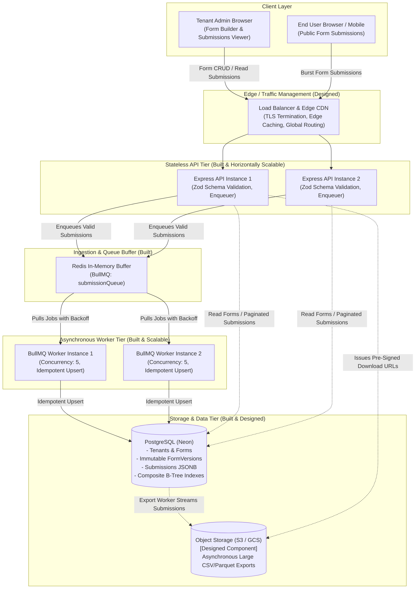

# System Architecture & Technical Specification

This document provides a comprehensive technical breakdown of the **Webform Builder & Submission Platform**, explaining its design, core invariants, request flows, scalability strategies, and built vs. designed capabilities.

---

## 1. High-Level Architecture Diagram



### ASCII Architecture Overview

```text
       Browser (Admin / Public)
                  ↓
       Load Balancer / CDN (Designed)
                  ↓
         API Instances (Built)
            ├── Validates schema in-memory (Zod)
            ├── Direct read queries for forms/submissions
            └── Enqueues writes
                  ↓
         Redis + BullMQ (Built)
            └── Durable buffering & exponential backoff
                  ↓
          Workers (Built)
            └── Controlled concurrency persistence
                  ↓
         PostgreSQL (Built)
            └── Immutable versions + Submissions JSONB
                  │
                  ▼ [Designed]
          Object Storage (S3 / GCS)
            └── Asynchronous large CSV / JSON export dumps
```

---

## 2. End-to-End Request Flows

### 2.1 Form Creation & Initial Draft
1. **Client Action**: Tenant admin submits `POST /api/forms` with `{ name, schema }`.
2. **Authentication / Tenant Context**: Tenant identifier (`tenantId`) is resolved from the session or dev context (`DEV_TENANT`).
3. **Request Validation**: Zod validates the schema envelope and field definitions (verifying supported types: `text`, `email`, `number`, `select`, `multiselect`, `radio`, `checkbox`, `date`).
4. **Persistence**: In a single transaction, PostgreSQL creates:
   - A `Form` row scoped to `tenantId`.
   - A `FormVersion` row with `version: 1`, `status: 'DRAFT'`, and `schema: JSONB`.
5. **Response**: HTTP `201 Created` returning the form metadata and draft version.

### 2.2 Draft Editing
1. **Client Action**: Tenant admin submits `PUT /api/forms/:id/draft` with updated schema.
2. **State Inspection**: The API locates the existing form under the active tenant.
3. **Branching Logic**:
   - If a `DRAFT` version already exists, its `schema` JSONB is updated directly.
   - If the latest version is already `PUBLISHED`, the system automatically forks a **new** `FormVersion` record with `version = maxVersion + 1`, `status: 'DRAFT'`, leaving the published version completely untouched.
4. **Response**: HTTP `200 OK` with the active draft record.

### 2.3 Publishing
1. **Client Action**: Tenant admin submits `POST /api/forms/:id/publish`.
2. **Atomic Transaction**:
   - Locates the current `DRAFT` record.
   - Validates that the draft contains valid non-empty schema definitions.
   - Atomically updates the draft record: sets `status = 'PUBLISHED'` and `publishedAt = new Date()`.
   - Ensures no other drafts exist for this version sequence.
3. **Immutability Guarantee**: Once `status = 'PUBLISHED'`, all subsequent updates to this record are strictly forbidden by API route logic and application invariants.

### 2.4 Public Form Serving
1. **Client Action**: End-user navigates to public URL (`/public/forms/:formId` or `/forms/:formId`).
2. **Lookup**: Browser requests `GET /api/public/forms/:formId`.
3. **Security Filtering**:
   - Queries `FormVersion` where `formId = :formId` and `status = 'PUBLISHED'`, ordered by `version DESC` limit 1.
   - If no published version exists, immediately returns HTTP `404 Not Found`.
   - **Data Redaction**: Returns `{ id, formId, version, schema }`. The internal `tenantId` is omitted to prevent multi-tenant reconnaissance.

### 2.5 Submission Ingestion & Validation
1. **Client Action**: User submits `POST /api/public/forms/:formId/submissions` with `{ data: { ... } }`.
2. **Abuse Protection**: Rate limiter checks IP + formId frequency (60 requests/min per IP in production). Body parser enforces 1MB payload limit (`HTTP 413` on violation).
3. **Published Schema Retrieval**: The API fetches the currently active `PUBLISHED` `FormVersion`.
4. **Dynamic Schema Validation (Server-Side)**:
   - Computes field visibility based on conditional rules (`visibleWhen: { field, equals }`).
   - If a conditional field's controlling condition is not met, the field is treated as hidden and stripped.
   - For all visible fields, enforces type conformance:
     - `text`: must be string.
     - `email`: must be string and match RFC 5322 regex.
     - `number`: must be finite number.
     - `select` / `radio`: must match an option value defined in the schema.
     - `multiselect`: must be an array of valid option values.
     - `checkbox`: must be boolean.
     - `date`: must be a valid ISO-8601 date string.
     - `required`: if visible and missing/empty, returns validation error.
   - If any validation rule fails, returns HTTP `400 Bad Request` with field-level details.

### 2.6 Fast-Path Queue Enqueueing
1. **UUID Generation**: The API generates a cryptographically random UUID `submissionId` upfront.
2. **BullMQ Enqueue**: The API enqueues a job to BullMQ `submissionQueue`:
   - Job ID: `submissionId` (enforces queue-level deduplication).
   - Payload: `{ submissionId, tenantId, formId, formVersionId, data: cleanedData, submittedAt }`.
   - Retry Strategy: 3 attempts with exponential backoff (`delay: 1000ms`).
   - Retention: Keeps completed/failed jobs up to 24 hours / 10,000 jobs for auditing.
3. **Immediate Acknowledgement**: The API returns HTTP `202 Accepted` with `{ status: 'accepted', id: submissionId }`. The client is freed in milliseconds without waiting on PostgreSQL disk I/O.

### 2.7 Asynchronous Worker Processing & PostgreSQL Storage
1. **Job Pull**: Distributed BullMQ worker pulls job from Redis when processing capacity is available (concurrency: 5 workers).
2. **Idempotent Persistence**: The worker executes:
   ```ts
   await prisma.submission.upsert({
     where: { id: submissionId },
     update: {}, // No-op if already processed
     create: {
       id: submissionId,
       tenantId,
       formId,
       formVersionId,
       data: cleanedData,
       createdAt: new Date(submittedAt),
     },
   });
   ```
3. **Database Constraints & Indexes**: PostgreSQL commits the record into the `Submission` table with foreign key validation against `Tenant`, `Form`, and `FormVersion`.
4. **Job Acknowledgement**: BullMQ removes the job from active status only **after** PostgreSQL has committed the write.

### 2.8 Submission Retrieval
1. **Client Action**: Tenant admin requests `GET /api/forms/:id/submissions?page=1&limit=25&sort=desc`.
2. **Multi-Tenant Scoping**: The query strictly filters `where: { tenantId: DEV_TENANT.id, formId: :id }`.
3. **Pagination & Limits**: Supports `page` and `limit` (strictly capped at `100` max items to prevent heap exhaustion).
4. **Sorting & Date Filtering**: Leverages B-Tree index on `(formId, createdAt DESC)` for sub-millisecond retrieval.
5. **Response**: HTTP `200 OK` with paginated records and metadata (`total`, `page`, `limit`, `totalPages`).

---

## 3. In-Depth Requirement Analysis

### 3.1 Bursty Public Traffic
Public webforms experience extreme volatility (marketing campaigns, viral promotions, incident reports). Handling bursts requires preventing database connection pool starvation.

* **Horizontal API Scaling**: The API servers are 100% stateless. Node/Express instances can be scaled horizontally behind a round-robin load balancer without session affinity or sticky routing.
* **Rate Limiting**: Multi-tiered rate limiting stops volumetric flooding:
  - Global API limiter: 1,000 requests per 15 minutes per IP.
  - Per-form limiter: 60 requests per minute per IP per form.
* **Queue Buffering**: Rather than synchronously opening a PostgreSQL transaction on every incoming submission, the API writes a compact JSON payload to Redis via BullMQ. Redis handles tens of thousands of writes per second in-memory.
* **Worker Concurrency Capping**: Workers process jobs at a controlled concurrency (`concurrency: 5` per worker process). Even if 100,000 submissions arrive within 30 seconds, PostgreSQL only experiences a predictable, steady stream of concurrent write connections.
* **Database Protection**: Connection pools are never exhausted, memory spikes on the DB are prevented, and disk write IOPS remain bounded.

### 3.2 Guaranteeing No Lost Submissions & Acknowledgement Semantics
Reliability is paramount for form submissions (e.g., job applications, payments, support tickets).

* **Precise Acknowledgement Semantics**:
  - The API does **not** return `200 OK` or `202 Accepted` unless Redis has acknowledged the job write to durable memory (`AOF/RDB`).
  - The BullMQ Worker does **not** acknowledge or remove the job from the Redis queue until PostgreSQL successfully completes the database write transaction.
  - If a worker crashes mid-execution, BullMQ detects lock expiration and automatically reassigns the job to another healthy worker.
* **Automatic Retries with Exponential Backoff**:
  - Configured with `attempts: 3` and exponential backoff (`backoff: { type: 'exponential', delay: 1000 }`).
  - Transient database hiccups (network disconnects, deadlocks, cold starts on serverless Postgres) trigger retries rather than silent failures.
* **Idempotency Guarantees**:
  - Because retries can cause a job to be executed more than once (at-least-once delivery), the client or API assigns an immutable UUID `submissionId` prior to enqueueing.
  - Workers use `prisma.submission.upsert` keyed on `id`. If a job is executed twice, the second execution is a deterministic no-op. Duplicate rows can never be inserted.
* **Dead-Letter Auditing**:
  - Jobs failing all retry attempts are retained in BullMQ’s failed set with stack traces and submission payloads, allowing manual inspection and replay.

### 3.3 Multi-Tenancy & Isolation
The platform is designed to securely isolate tenant data across shared infrastructure.

* **Tenant Ownership**: Every primary entity (`Form`, `Submission`) includes a required foreign key `tenantId` linking to the `Tenant` table.
* **Authorization Filtering**: All administrative and analytical endpoints enforce tenant isolation:
  ```ts
  const forms = await prisma.form.findMany({
    where: { tenantId: req.tenant.id }
  });
  ```
  Attempting to read or modify a form belonging to another tenant results in HTTP `404 Not Found`, denying the existence of the foreign resource.
* **Database Constraints & Composite Indexes**:
  - Index `@@index([tenantId, createdAt])` ensures queries are always scoped to the tenant partition.
  - Index `@@index([formId, createdAt])` guarantees performant querying of form submissions.
* **Noisy-Neighbor Protection**:
  - Per-form and per-IP rate limiters prevent a surge on one tenant's form from exhausting the API or Redis resources needed by other tenants.
  - Future expansion: dedicated Redis priority queues or tenant-specific worker pools for tier-1 tenants.

### 3.4 Data Integrity & Schema Versioning
Forms evolve over time: fields are renamed, options change, and validation rules shift.

* **Immutable Form Versions**:
  - When a form version is marked `PUBLISHED`, it is frozen permanently.
  - Updates to published versions are disallowed at the route and business logic levels.
  - Modifying a published form automatically branches a new `DRAFT` version (`version + 1`).
* **Permanent Historical Linkage**:
  - Every `Submission` record stores `formVersionId`, referencing the exact `FormVersion` active when the submission occurred.
  - If Version 1 had `{ fullName: text }` and Version 2 adds `{ phoneNumber: text }`, historical Version 1 submissions remain valid and intact. They are never subjected to retroactive schema migrations or nullified columns.

### 3.5 Security & Defense-in-Depth
* **Strict Server-Side Validation**: Dynamic forms are completely re-validated on the server. The client-side form renderer is treated as an untrusted UI helper; all types, regexes, option whitelists, and required constraints are re-evaluated by the API.
* **XSS Prevention**:
  - Submission payloads stored in JSONB are treated as raw data values.
  - The React frontend escapes dynamic text content by default using standard React JSX interpolation (`{fieldValue}`).
  - Rich HTML interpretation is avoided.
* **Payload Size Limits**: Express enforces a strict 1MB JSON limit (`express.json({ limit: '1mb' })`). Oversized payloads trigger HTTP `413 Payload Too Large` before parsing.
* **HTTP Security Headers**: Powered by `helmet`, setting headers including `X-Content-Type-Options: nosniff`, `X-Frame-Options: SAMEORIGIN`, and strict referrers.
* **CORS**: Configured with origin whitelisting (`cors({ origin: process.env.CLIENT_URL })`) to block cross-origin browser abuse.

### 3.6 Dynamic Schemas via PostgreSQL JSONB
* **Why JSONB?**:
  - Form builders allow arbitrary custom fields created at runtime without DDL migrations.
  - Relational schemas with dynamic columns (`ALTER TABLE ADD COLUMN`) require exclusive locks and cannot scale to hundreds of custom forms.
  - Entity-Attribute-Value (EAV) anti-patterns require dozens of table joins per submission, degrading query performance.
  - PostgreSQL `JSONB` stores decomposed binary JSON with fast key lookup, validation support, and indexing capabilities.
* **Trade-Offs**:
  - JSONB does not enforce SQL foreign keys inside nested JSON properties.
  - Handled by performing strict validation against the `FormVersion.schema` before writes occur.

### 3.7 Large Submission Volumes & Future Scaling
* **Efficient Pagination**: Queries enforce `take` / `skip` pagination capped at 100 rows, paired with `(formId, createdAt DESC)` B-Tree indexing.
* **Asynchronous Large Exports (Designed)**:
  - For exporting 500,000+ submissions to CSV or Parquet, synchronous HTTP streaming risks worker timeouts and memory exhaustion.
  - **Designed Architecture**: An asynchronous export job is enqueued to BullMQ. A background worker streams submissions from PostgreSQL using cursor pagination, compresses them into a CSV/Parquet file, uploads it directly to Object Storage (S3 / GCS), and generates a pre-signed download URL emailed to the admin.
* **Table Partitioning (Future Scaling Option)**:
  - As submissions reach tens of millions, PostgreSQL native declarative partitioning by `createdAt` (range partitioning by month) or hash partitioning by `tenantId` allows partition pruning during queries and instant archiving of old partitions.
* **Read Replicas (Future Option)**:
  - Read-heavy administrative dashboards can be offloaded to read-only PostgreSQL replicas, reserving the primary database instance strictly for worker write upserts.

---

## 4. Built vs. Designed Capabilities

The following table honestly distinguishes features fully implemented and tested in the codebase versus architectural designs planned for production scale.

| Feature / Component | Status | Implementation Details |
| :--- | :--- | :--- |
| **Dynamic Form Creation** | **Built** | `POST /api/forms` with Zod schema validation; creates Form and Version 1 DRAFT. |
| **Draft Management** | **Built** | `PUT /api/forms/:id/draft` modifies active draft or forks new version if latest is published. |
| **Form Publishing** | **Built** | `POST /api/forms/:id/publish` atomically transitions draft to PUBLISHED with timestamps. |
| **Immutable Form Versions** | **Built** | Published versions cannot be altered; subsequent edits spawn version `N+1`. |
| **Public Form Serving** | **Built** | `GET /api/public/forms/:formId` serves published schema; strips tenant metadata. |
| **Dynamic UI Renderer** | **Built** | React component supporting 8 field types, client validation, and conditional rules. |
| **Server-Side Dynamic Validation** | **Built** | Server re-validates submission values, regexes, option whitelists, and conditional visibility. |
| **Asynchronous BullMQ Queue** | **Built** | Redis + BullMQ `submissionQueue` with exponential backoff and job retention. |
| **Background Submission Worker** | **Built** | BullMQ worker with concurrency 5, error recovery, and graceful shutdown. |
| **Idempotent Ingestion** | **Built** | Pre-generated UUID `submissionId` with `prisma.submission.upsert` preventing duplicates. |
| **Submission Retrieval & Pagination** | **Built** | `GET /api/forms/:id/submissions` with page, limit (max 100), sort, and date filters. |
| **Burst Load Generator** | **Built** | Node/TS CLI load tester (`npm run load:test`) measuring req/s, avg, p95, and p99 latency. |
| **Correctness Test Suite** | **Built** | Automated Vitest suite verifying validation, version integrity, queue retries, and idempotency. |
| **Rate Limiting & Abuse Defense** | **Built** | Express rate limiters (global 1000/15min, form 60/min/IP) and 1MB body limit. |
| **Multi-Tenant Scoping** | **Built (Scoped)** | Foreign keys and queries enforce tenant scoping (`tenantId`); default dev tenant context. |
| **User Authentication / JWT** | **Designed** | Multi-tenant schema has `Tenant` model; full JWT / OAuth2 auth is designed for next milestone. |
| **Object Storage Exports (S3 / GCS)** | **Designed** | Designed for async large CSV exports; currently handled via paginated JSON API queries. |
| **CDN / Edge Load Balancer** | **Designed** | Cloudflare / AWS ALB layer for TLS termination and global distribution. |
| **Horizontal Auto-Scaling** | **Designed** | Stateless API and worker containers designed for Kubernetes / ECS Horizontal Pod Autoscaler. |
| **PostgreSQL Table Partitioning** | **Designed** | Declarative range partitioning on `Submission(createdAt)` designed for multi-million row scale. |
| **Read Replicas** | **Designed** | Read replica routing for administrative dashboards designed for future database tier scale. |
